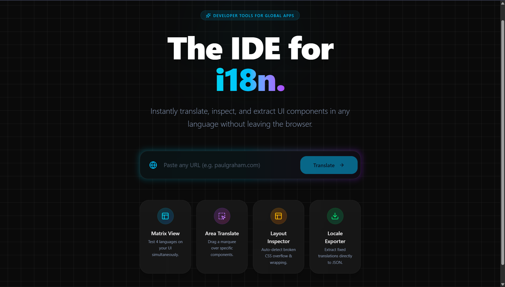
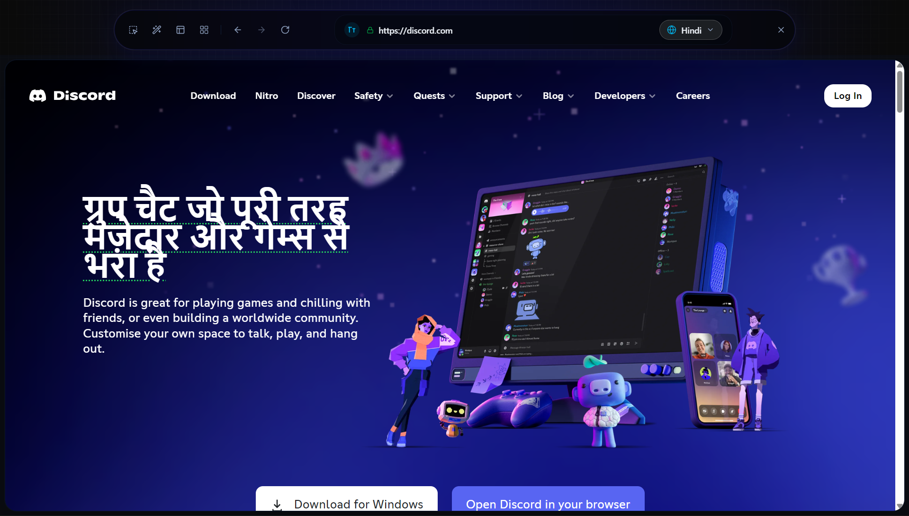
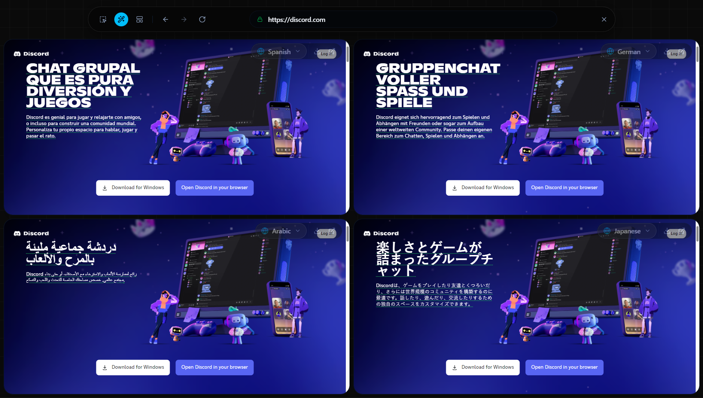
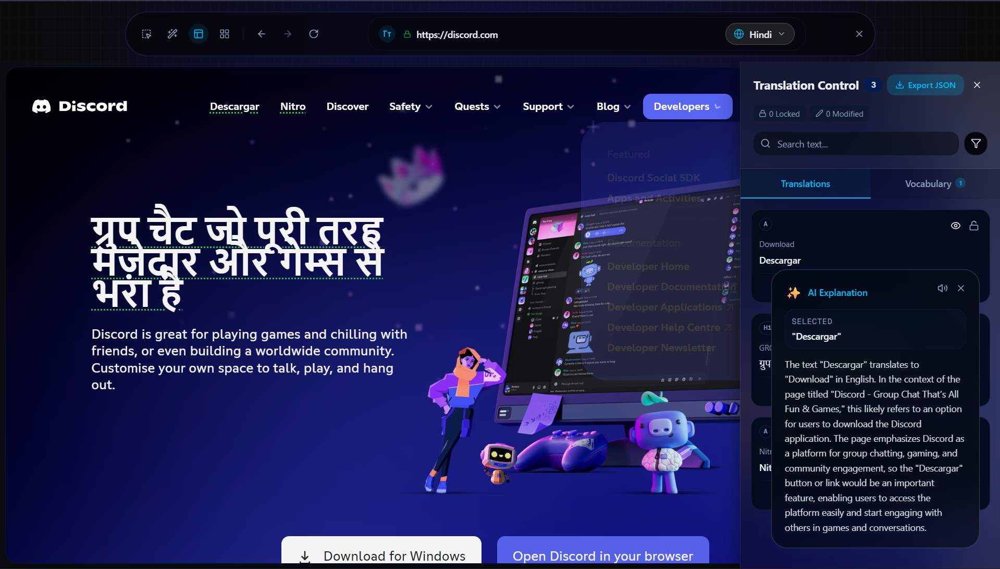
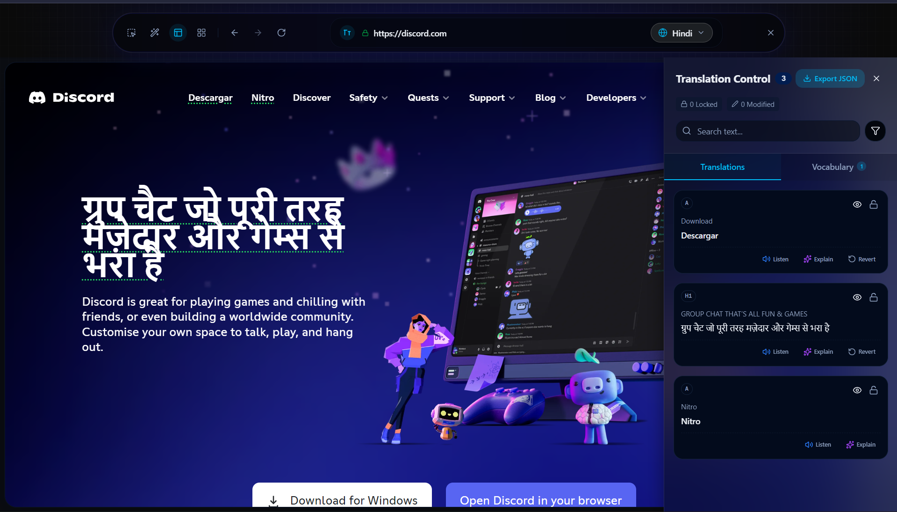
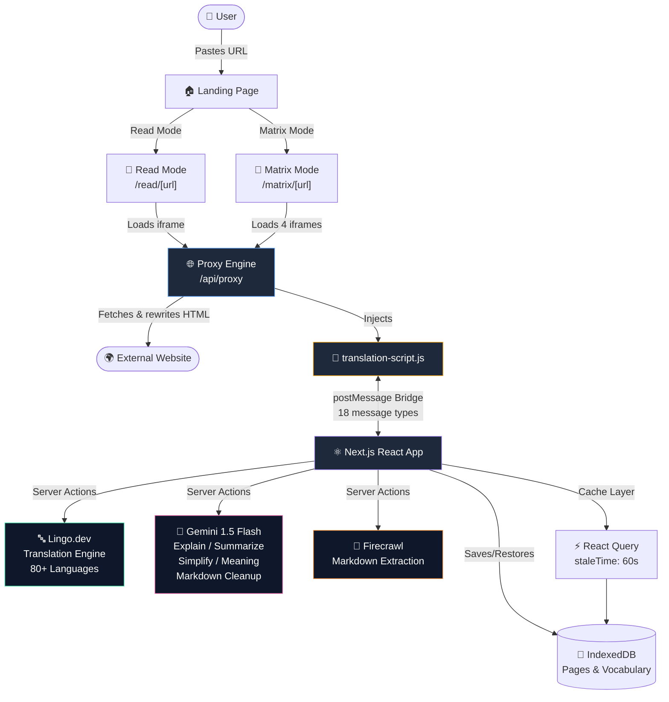
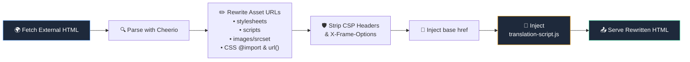
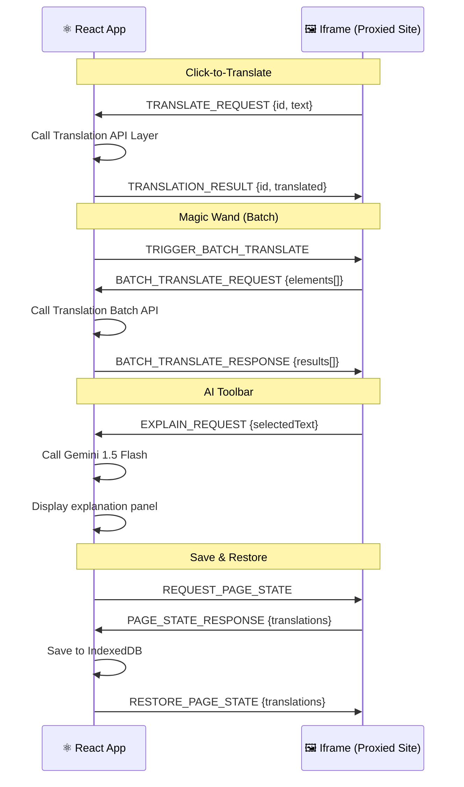
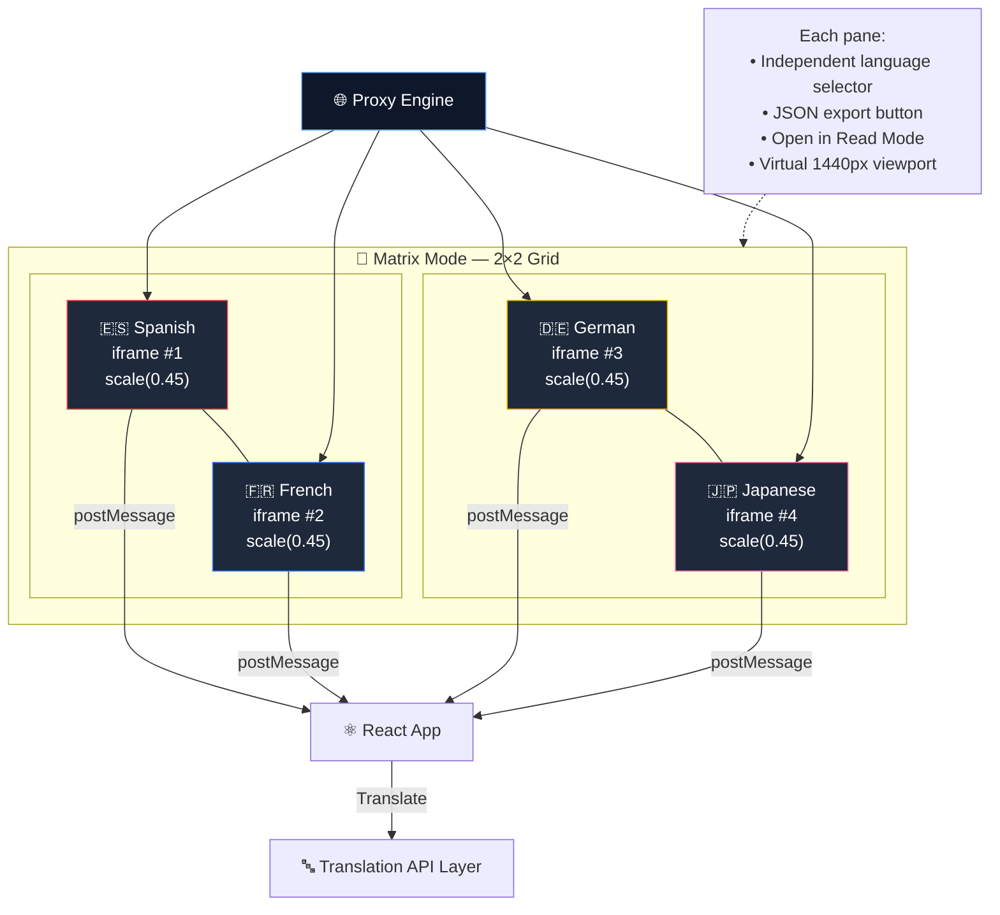

<div align="center">
  <br />
  <br />

  <h1>🔍 LingoLens</h1>
  <p><b>Translate the Web. Preserve the Design. Don't Break Stuff.™</b></p>
  <p><i>Because Google Translate turning a beautiful website into a crime scene isn't okay anymore.</i></p>

  <p>
    <a href="#-the-problem-we-all-pretend-doesnt-exist">The Problem</a> •
    <a href="#-our-fix-lingolens">The Fix</a> •
    <a href="#-features-the-fun-part">Features</a> •
    <a href="#-the-2x2-matrix-mode-the-showstopper">Matrix Mode</a> •
    <a href="#-demo-video">Demo Video</a> •
    <a href="#%EF%B8%8F-the-tech-stack-nerd-corner">Tech Stack</a> •
    <a href="#-architecture-overview">Architecture</a> •
    <a href="#-wanna-try-it">Try It</a>
  </p>
</div>

---

## 🎥 Demo Video

▶️ **Watch the full demo:**  
[demo.mp4](./demo.mp4)

👉 **Stay till 3:11 to see Matrix Mode**, the most powerful feature of LingoLens.  
It shows the same website translated into four languages at once and makes layout issues instantly visible.

---

## 📸 Screenshots

<div align="center">

### Landing Page

*The homepage — clean, dark, and ready to proxy the entire internet.*

### Read Mode — Single Translation View

*A proxied website with live, layout-preserving translations. Click any text to translate it in-place.*

### 🔥 Matrix Mode — 2x2 Multi-Language Preview

*The same website in four languages simultaneously. Spanish, French, Japanese, Arabic — side by side. Your move, Google Translate.*

### AI Explain / Summarize Toolbar

*Select any text and get instant AI-powered explanations, summaries, or simplified versions.*

### Translation Panel & Library

*Every translation tracked, editable, lockable, and exportable. Your personal translation workspace.*

</div>

---

## 😤 The Problem We All Pretend Doesn't Exist

You find a gorgeous Japanese blog post. Beautiful typography. Stunning layout. Chef's kiss CSS.

Then you hit "Translate to English" and...

1. **💀 The UI dies.** German words are *long*. "Geschwindigkeitsbegrenzung" doesn't fit in a button meant for "Speed". Buttons overflow. Layouts collapse. Designers everywhere feel a disturbance in the force.
2. **🤷 Context? Never heard of her.** The translation says "he kicked the bucket" and now you think a man literally kicked a bucket. Idioms, cultural references, sarcasm — all murdered in cold blood by literal translation.
3. **😭 The vibes are ruined.** You came for the *experience* of a beautiful website. You got a wall of mangled text that looks like it was formatted by a microwave.

I've been there. I've suffered. It's time to stop.

---

## 🚀 The Fix: LingoLens

LingoLens is what happens when one developer asks: *"What if I could translate websites... without destroying them?"*

It's a **Translator Browser** — a proxy engine that loads any website in a sandboxed iframe, then lets you translate text **without touching a single pixel of the original layout**.

Click a paragraph? Translated. Hit the ✨ **Magic Wand**? Every visible element gets translated in one satisfying sweep. The CSS stays perfect. The fonts stay crisp. The designer who made that website can sleep peacefully tonight.

> **TL;DR:** I built Google Translate, but with *taste*.

---

## ✨ Features (The Fun Part)

### 🎨 Layout-Preserving Translation
Built for the **Gemini Hackathon**, translations swap text in the DOM while respecting the original font weights, spacing, and CSS properties. There's even a **Layout Safety Inspector** that screams at you (politely, with a ⚠️ badge) if a translation causes overflow or wrapping issues.

> No layouts were harmed in the making of this translation.

### 🧠 AI-Powered Intelligence (Powered by Google Gemini)
Ever translate something and think *"...okay but what does that actually mean?"*

LingoLens uses **Google Gemini** as the AI backbone for all intelligence features. Select any text and the AI toolbar lets you:
- **✨ Explain** — Get a 2-line context-aware explanation powered by **Gemini 1.5 Flash**
- **📝 Summarize** — Too long, didn't translate? Gemini condenses it for you
- **🧒 Simplify** — Gemini explains it like you're five (ELI5)
- **📖 Meaning** — Gemini deep-dives into the meaning with full page context
- **🧹 Markdown Cleanup** — Gemini extracts clean, readable article content from raw scraped HTML

Every AI action reads the surrounding context — the article body, the page title, the URL — and **Gemini** generates responses that actually make sense in context. It's not a generic dictionary lookup; it's a context-aware AI assistant that understands the *page* you're reading.

> 🔑 All AI intelligence in LingoLens is powered by **Google Gemini 1.5 Flash** via the `@ai-sdk/google` SDK.

### 🌐 Translation Engine (Powered by Lingo.dev)
The actual text translation across **80+ languages** is powered by the **Lingo.dev** translation engine. When you click a paragraph or hit the Magic Wand, the text is sent to Lingo.dev's i18n API for fast, accurate multilingual translation — while Gemini handles all the understanding, explanation, and content processing.

### 🎯 Marquee Select Tool
Don't want to translate the whole page? Draw a rectangle over the area you want translated — like a screenshot tool, but for languages. Only the elements inside your selection get translated. Surgical precision.

### 💾 Save & Restore
Every translated page gets auto-saved to **IndexedDB** (not localStorage — we're not animals). Come back later, and your translations are restored exactly as you left them. Vocabulary gets saved with AI explanations attached.

### 🔊 Text-to-Speech
Click the 🔊 button and hear how the translated text actually sounds. Uses the Web Speech API with smart voice matching — it picks the best available voice for each language, prioritizing natural-sounding ones over the robotic defaults.

### 📦 Export to JSON
Working on an i18n project? Hit **Export JSON** and get a clean `{ "original": "translated" }` mapping. Instant localization files. Your product manager will think you're a wizard.

---

## 📐 The 2x2 Matrix Mode (The Showstopper)

Why translate into one language when you can do **four at once**?

Matrix Mode opens a **2x2 grid** of the same website — each quadrant translated into a **different language**, side by side, in real time.


**How it works:**
- The same proxied page is loaded in **4 separate iframes**
- Each pane has its own **language selector** — pick any of the 80+ supported languages
- Hit the ✨ **Magic Wand** and all four panes translate simultaneously
- Each pane scales the page to a virtual **1440px desktop viewport** using CSS transforms, so even in tiny quadrants they look like real full-width websites
- Every pane has a **Download JSON** button to export translations as i18n-ready files
- Click the **↗ External Link** icon to pop any pane into full Single Read Mode

> Spanish top-left, Japanese top-right, Arabic bottom-left, French bottom-right. 
> It's like the multiverse of languages, but for websites. And yes, I'm showing off.

This is the feature I built specifically to make judges go *"wait, that's actually really cool."*

---

## 🏗️ Architecture Overview

### System Flow



### Proxy Engine Pipeline



### PostMessage Bridge Protocol



### Matrix Mode Architecture



---

## 🛠️ The Tech Stack (Nerd Corner)

| What | Why |
|------|-----|
| **Next.js 16** (App Router) | Because I like living on the bleeding edge |
| **TypeScript** | Because `any` is not a personality type |
| **Google Gemini 1.5 Flash** | 🧠 The AI brain — powers **Explain, Summarize, Simplify, Meaning**, and **Markdown Cleanup** via `@ai-sdk/google` |
| **Lingo.dev** | 🌐 Translation engine — fast multilingual translation across **80+ languages** via their i18n API |
| **Firecrawl** | Extracts clean markdown from any URL (for article mode) |
| **Cheerio** | Server-side HTML surgery for the proxy engine |
| **Tailwind CSS 4 + shadcn/ui** | Glassmorphism that would make Apple jealous |
| **TanStack React Query** | State management that doesn't make me cry |
| **IndexedDB** (via `idb`) | Client-side database for saved pages & vocabulary |
| **Web Speech API** | TTS that doesn't sound like a GPS from 2008 |
| **Zod** | Because runtime errors are for people who enjoy pain |

---

## 🔥 The "Hack": Yes, I Built a Browser Inside a Browser

*(Judges, this is the part where I hope you go "oh that's actually clever.")*

The hardest part wasn't the AI. It wasn't the translations. It was **proxying the modern web**.

Here's what I had to do:

1. **🌐 Build a full reverse proxy** — The `/api/proxy` route fetches any external website, parses the HTML with Cheerio, and rewrites *every single asset URL* (stylesheets, scripts, images, srcsets, CSS `@import`s, inline `url()`s) to route through my proxy. I also strip `Content-Security-Policy` headers and `X-Frame-Options` so the page actually loads in an iframe.

2. **🔌 Build a postMessage bridge** — The React app and the iframe live in different security contexts. They can't talk directly. So I built a full async message protocol with **18 different message types** — translate requests, batch operations, state snapshots, layout error reports, theme detection, and more. It's basically TCP but with `window.postMessage`.

3. **💉 Inject a translation runtime** — I inject `translation-script.js` into every proxied page. This 600+ line vanilla JS bundle handles hover detection, click-to-translate, batch processing, layout safety inspection, area selection (marquee tool), a floating AI toolbar, and state restore. All without a single npm dependency.

4. **📐 Scale 4 full-width websites into a 2×2 grid** — Matrix Mode renders four iframes at a virtual 1440px desktop width and uses `CSS transform: scale()` with `ResizeObserver` to shrink them into each grid quadrant. Each pane is independently language-selectable, translatable, and exportable. Building this felt like putting ships in bottles.

> I essentially built a browser inside a browser. Yo dawg, I heard you like browsers...

---

## 🏃 Wanna Try It?

1. **Clone it:**
   ```bash
   git clone https://github.com/your-repo/lingolens.git
   cd lingolens
   ```

2. **Install dependencies:**
   ```bash
   npm install
   ```

3. **Add your API keys** — Create a `.env.local` file:
   ```env
   LINGODOTDEV_API_KEY=your_lingo_dev_key
   GOOGLE_GENERATIVE_AI_API_KEY=your_gemini_key
   FIRECRAWL_API_KEY=your_firecrawl_key
   ```

4. **Start it up:**
   ```bash
   npm rundev
   ```

5. **Open** `http://localhost:3000`, paste any URL, and watch the magic happen ✨

---

## 🗂️ Project Structure (For the Curious)

```
app/
├── page.tsx                    # Landing page (the pretty one)
├── read/[...url]/page.tsx      # Single translation mode
├── matrix/[...url]/page.tsx    # 2x2 Matrix mode (the flex)
├── library/page.tsx            # Saved translations library
├── api/proxy/route.ts          # The reverse proxy engine
└── actions/                    # Server Actions (AI calls)
    ├── translate.ts            # Lingo.dev — Single translation
    ├── translateBatch.ts       # Lingo.dev — Batch translation
    ├── explain.ts              # ✨ Gemini — Context-aware explanation
    ├── summarize.ts            # ✨ Gemini — Text summarization
    ├── simplify.ts             # ✨ Gemini — ELI5 simplification
    ├── meaning.ts              # ✨ Gemini — Word/phrase meaning
    ├── fetchContent.ts         # Firecrawl — Article extraction
    └── cleanMarkdown.ts        # ✨ Gemini — Markdown cleanup

components/
├── TranslationPanel.tsx        # The side panel with all the controls
├── LanguageSelector.tsx        # 80+ language picker
├── ArticleHeader.tsx           # Article metadata display
├── MDXRender.tsx               # Markdown renderer
└── ui/                         # shadcn/ui components

lib/
├── db.ts                       # IndexedDB setup
├── hooks/useLibrary.ts         # React Query hooks for persistence
├── languages.ts                # 80+ supported languages
├── tts.ts                      # Text-to-Speech engine
└── utils.ts                    # URL reconstruction & helpers

public/
└── translation-script.js       # The injected iframe runtime (the real MVP)
```

---

## 🧑‍💻 Built Solo

Yep — this whole thing was built by **one person**. No team. No division of labor. Just one sleep-deprived developer who thought *"how hard could it be to proxy the entire internet?"*

Spoiler: hard. Very hard. But I did it, and I had fun (mostly). The 2x2 Matrix Mode alone nearly broke me — scaling four full-width iframes into a responsive grid while keeping them all independently translatable is the kind of problem that sounds simple until you actually try it at 3 AM.

> If you're reading this, I survived. Barely. Send coffee.

---

## 📜 License

Built for the **Gemini Hackathon** with ❤️, caffeine, and an unreasonable amount of `console.log` debugging.

---

<div align="center">
  <b>LingoLens</b> — <i>Translate the Web. Preserve the Design. Understand the Context.</i>
  <br />
  <br />
  ⭐ Star this repo if it made you smile (or if it saved your CSS from destruction)
</div>
